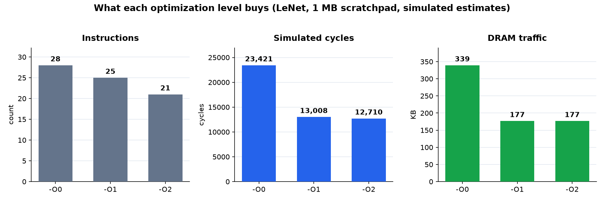
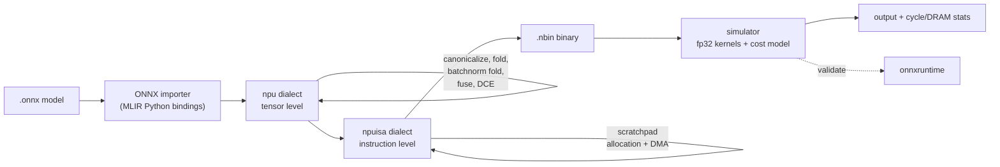

# MLIR Backend for a Simulated Edge NPU

**A from scratch deep learning compiler.** It takes a trained neural network in
ONNX form, compiles it through two custom [MLIR](https://mlir.llvm.org) dialects
and a real optimization pipeline down to a binary instruction stream for a
simulated edge accelerator, then runs that stream in a cycle costed simulator and
checks the answer against onnxruntime.

[](https://github.com/Olajide-Badejo/MLIR-Backend-for-a-Simulated-Edge-NPU/actions/workflows/ci.yml)


I built this to understand how a production machine learning compiler actually
works, by writing one. Every piece is here: the dialect definitions, the shape
verifiers, the folding and fusion passes, a dialect conversion lowering, a
register style scratchpad allocator that spills to memory, a documented binary
format with a disassembler, and a numerics accurate simulator. It compiles a
LeNet end to end and the simulated output matches onnxruntime to within floating
point rounding.

---

## The headline

Compiling LeNet and running it through the simulator, here is what the three
optimization levels buy, and the fact that matters most: **the answer stays
correct the whole way down.**



| Metric (LeNet, 1 MB scratchpad) | `-O0` | `-O1` | `-O2` |
|---|---:|---:|---:|
| Instructions | 91 | 82 | **70** |
| Simulated cycles | 23,421 | 13,008 | **12,710** |
| DRAM traffic | 339 KB | 177 KB | **177 KB** |
| Max error vs onnxruntime | 3e-8 | 3e-8 | 3e-8 |

`-O1` canonicalization and dead code elimination strip out the dead transposed
weight constants the importer leaves behind, roughly halving DRAM traffic. `-O2`
fusion folds every activation into its convolution or matmul, cutting the
instruction count and the cycle estimate. The error column is the point of the
whole exercise: optimizing hard while staying numerically exact. Every
performance number is a simulated estimate from an analytical cost model, and is
labeled as such throughout.

---

## How it works



The design uses **two dialects**, which is how real MLIR backends are structured:

- **`npu`** is the tensor level, where the graph still looks like math. Values are
  fp32 tensors, and this is where the interesting optimizations happen.
- **`npuisa`** is the instruction level, after I have decided where data lives. It
  has an explicit two level memory model: a small fast scratchpad and DRAM, with
  data crossing between them only through explicit DMA instructions.

Going from one to the other is a genuine representation change (SSA tensors become
scratchpad addresses), so it is built on MLIR's dialect conversion framework with
a type converter, not ad hoc rewrites.

---

## See it run

```bash
# Compile a model straight to a binary instruction stream at -O2.
npu-compile lenet.onnx -O2 -o lenet.nbin

# Disassemble it like a real objdump.
npu-objdump lenet.nbin
```

```
; scratchpad 198120 bytes, dram 180880 bytes
; 1 inputs, 1 outputs, 10 constants, 21 instructions

.dram
  input0  @0x0    [1x1x28x28]
  const3  @0x296e0 [6x1x5x5]
  output0 @0x2c268 [1x10]

.text
  0: DMA_LOAD  sp[0x0]     <- dram[0x0]     [1x1x28x28]
  4: DMA_LOAD  sp[0x296e0] <- dram[0x296e0] [6x1x5x5]
 10: CONV2D    sp[...] <- sp[...], sp[...]  [1x6x24x24] act=relu
 12: POOL_MAX  sp[...] <- sp[...]           [1x6x12x12]
 ...
```

That fused `CONV2D ... act=relu` is the operator fusion pass at work: the
convolution, its bias, and its activation are one instruction, so the intermediate
never leaves the scratchpad.

---

## Things I am proud of

- **A real BatchNorm folding pass.** At inference, batch norm parameters are
  constants, so `bn(conv(x))` is algebraically just another convolution. The pass
  does the tensor arithmetic at compile time and emits a single conv with rescaled
  weights, verified against a hand computed example.
- **A scratchpad allocator that spills.** It is a linear scan allocator with a free
  list. When the working set does not fit the budget, it spills the longest lived
  buffer to DRAM and reloads it, exactly like a register allocator spilling to the
  stack.
- **The benchmark suite caught a real bug.** Under a tight budget the spilled
  values came back wrong. The cause was in the binary encoder, which was not giving
  spill temporaries their own DRAM addresses, so they clobbered the input. Finding
  it, fixing it, and adding a regression test is written up in the
  [debug report](report_debug/).
- **Validated, not just plausible.** The whole pipeline is checked end to end
  against onnxruntime on seeded models, so correctness is demonstrated, not
  asserted.

---

## Build and run

The heavy lift is building LLVM and MLIR once. After that this is a small out of
tree project that builds in seconds. Full steps, including the exact toolchain
version and the memory budget the build runs under, are in
[docs/BUILD.md](docs/BUILD.md).

```bash
# After the one time LLVM/MLIR build at tag llvmorg-22.1.8:
cmake -G Ninja -S . -B build \
  -DMLIR_DIR=$HOME/llvm-project/build/lib/cmake/mlir \
  -DLLVM_DIR=$HOME/llvm-project/build/lib/cmake/llvm \
  -DLLVM_USE_LINKER=lld
ninja -C build

ninja -C build check-npu       # lit and FileCheck
./build/bin/NPUEncodingTests   # GoogleTest: binary format
./build/bin/NPUSimulatorTests  # GoogleTest: kernels and cost model
python -m pytest test/Python   # importer, driver, end to end vs onnxruntime
```

Coverage runs to **90% of lines on the C++ backend** (the optimization, lowering,
and allocation passes sit at 87 to 95 percent) and **89% on the Python frontend**.
Reproduce it with `scripts/coverage.sh`.

## What is in the box

| | |
|---|---|
| **Dialects** | `npu` (tensor level) and `npuisa` (instruction level) in ODS/TableGen with verifiers |
| **Passes** | canonicalize, constant fold, batchnorm fold, operator fusion, DCE, lower to npuisa, allocate scratchpad |
| **Frontend** | ONNX importer on the MLIR Python bindings, plus a seeded PyTorch model generator |
| **Backend** | binary `.nbin` encoder, `npu-objdump` disassembler, fp32 simulator, analytical cost model |
| **Tools** | `npu-compile`, `npu-opt`, `npu-translate`, `npu-objdump`, `npu-sim` |
| **Tests** | lit/FileCheck, GoogleTest, and pytest end to end against onnxruntime |

## Tech

C++17 and TableGen against LLVM/MLIR 22, Python 3.14 for the frontend and driver,
CMake and Ninja, GoogleTest, lit, and pytest, with the reports written in LaTeX
and built by tectonic.

## Documentation

[Architecture](docs/ARCHITECTURE.md) &middot;
[Design decisions](docs/DESIGN_DECISIONS.md) &middot;
[Optimization passes](docs/PASSES.md) &middot;
[ONNX frontend](docs/ONNX_FRONTEND.md) &middot;
[ISA manual](docs/ISA_MANUAL.md) &middot;
[Dialect reference](docs/DIALECT_REFERENCE.md) &middot;
[Engineering log](docs/ENGINEERING_LOG.md) &middot;
[Build](docs/BUILD.md) &middot;
[Contributing](docs/CONTRIBUTING.md)

There are also two write ups: a [main report](report/) covering the design and the
evaluation, and a [debug report](report_debug/) that is an honest postmortem of the
problems I hit and how I solved them.

## License

MIT. See [LICENSE](LICENSE).
